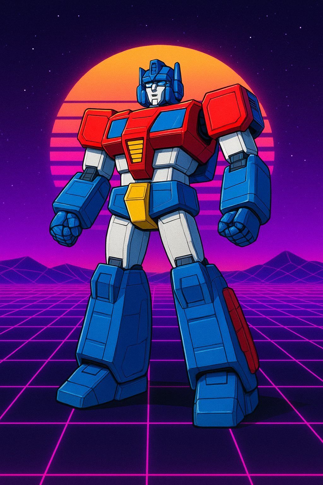

<div align="center">
  
</div>

# Transformer - Incrementally Built with AI

An educational GPT-style transformer incrementally built with AI in PyTorch. Every component is implemented by Claude's hand with comprehensive documentation to understand how modern LLMs work under the hood.

## Quick Start

```bash
# Install dependencies
make install

# Run all tests
make test

# Train on FineWeb (100M tokens per epoch)
make train

# Quick training (smaller model, 10M tokens/epoch)
make train-quick

# Generate text (interactive mode)
make generate
```

## What's Inside

This project implements a complete decoder-only transformer (GPT architecture) with:

- **Core Components** - Attention, embeddings, feed-forward networks, transformer blocks
- **Training Pipeline** - FineWeb dataset streaming, gradient accumulation, train/val split, learning rate scheduling
- **Text Generation** - KV-Cache optimization (2-50x faster!), advanced sampling strategies (greedy, top-k, top-p)
- **Evaluation** - Perplexity calculation and model comparison tools
- **Testing** - Test suite covering core components and functionality

**All components include extensive educational documentation** - read the source files to learn!

## Project Structure

```
src/transformer/
├── attention.py        # Scaled dot-product & multi-head attention mechanisms
├── embeddings.py       # Token embeddings & learned positional encodings
├── feedforward.py      # Feed-forward networks (MLP) with GELU activation
├── block.py            # Transformer blocks with Pre-LN architecture
├── model.py            # Complete decoder-only transformer with generation
├── sampling.py         # Advanced sampling strategies (top-k, top-p, combined)
├── perplexity.py       # Perplexity calculation and evaluation metrics
├── scheduler.py        # Learning rate scheduling (warmup + cosine decay)
├── training_utils.py   # Gradient accumulation for stable training
├── dataset.py          # Dataset utilities
└── fineweb_dataset.py  # FineWeb streaming with caching & train/val split

commands/
├── train.py            # Training command - see file for complete guide
├── generate.py         # Text generation with preset strategies
├── sampling_comparison.py   # Demo of different sampling strategies
└── evaluate_perplexity.py   # Model evaluation and comparison

tests/                  # Test suite for core components
```

## Learning Path

Want to understand transformers deeply? Read the code in this order:

1. **[`src/transformer/attention.py`](src/transformer/attention.py)** - Start here! The core self-attention mechanism
2. **[`src/transformer/embeddings.py`](src/transformer/embeddings.py)** - How tokens and positions are represented
3. **[`src/transformer/feedforward.py`](src/transformer/feedforward.py)** - Position-wise neural networks
4. **[`src/transformer/block.py`](src/transformer/block.py)** - How components combine (with gradient flow explanation!)
5. **[`src/transformer/model.py`](src/transformer/model.py)** - The complete architecture
6. **[`src/transformer/sampling.py`](src/transformer/sampling.py)** - How to generate high-quality text
7. **[`src/transformer/perplexity.py`](src/transformer/perplexity.py)** - How to evaluate language models
8. **[`commands/train.py`](commands/train.py)** - How to train the model

Each file has extensive documentation explaining concepts, design decisions, and mathematical details.

## Architecture Overview

**Decoder-Only Transformer** (GPT-style):

```
Input Token IDs
    ↓
[Token Embeddings] → Convert IDs to vectors
    ↓
[Positional Encodings] → Add position information (learned, not sinusoidal)
    ↓
[Transformer Block] → ┐
[Transformer Block] → ├─ Stacked N times (6 layers by default)
[Transformer Block] → ┘
    ↓
[Output Projection] → Project to vocabulary logits
    ↓
Next Token Predictions
```

**Each Transformer Block**:
- Multi-head self-attention (4 heads, causal masking)
- Feed-forward network (4x dimension expansion)
- Layer normalization (Pre-LN architecture like GPT-2/3)
- Residual connections (gradient highways!)
- Dropout for regularization

See [`src/transformer/block.py`](src/transformer/block.py) for detailed architecture diagrams and gradient flow explanation.

## Training

### Quick Start

```bash
# Default: 100M tokens/epoch, 6 layers, d_model=256, 16x gradient accumulation
# Auto-detects best device (CUDA > MPS > CPU)
uv run python main.py train

# Quick mode: 10M tokens/epoch, 4 layers, d_model=128
uv run python main.py train --quick

# Use smaller vocabulary (50K tokens vs 100K default)
uv run python main.py train --encoding p50k_base

# Custom gradient accumulation (higher = more stable training)
uv run python main.py train --accumulation-steps 32

# Force specific device (optional - auto-detect is recommended)
uv run python main.py train --mps    # Apple Silicon GPU
```

### Dataset: FineWeb

We use HuggingFace's [FineWeb-Edu](https://huggingface.co/datasets/HuggingFaceFW/fineweb-edu) dataset (sample-10BT):
- **10 billion tokens** of high-quality web content
- **Streaming**: Downloads shards on-demand (no huge upfront download)
- **Smart caching**: Keeps 5 recent shards (~2GB), automatically cleans up old ones
- **Configurable**: Default 100M tokens per epoch, adjust as needed

### Device Support

The training script automatically detects and uses the best available device:

1. **CUDA** (NVIDIA GPUs) - Preferred for maximum performance
   - Automatic mixed precision (bfloat16) for ~2x speedup
   - Memory tracking and synchronization utilities

2. **MPS** (Apple Silicon) - Excellent for Mac users
   - Native GPU acceleration on M1/M2/M3 chips
   - Significantly faster than CPU (5-10x)

3. **CPU** - Universal fallback
   - Works everywhere, good for learning and debugging

The device is selected automatically, but you can force a specific device with `--mps` if needed.

See [`commands/train.py`](commands/train.py) for complete training documentation.

## Text Generation

### Quick Examples

```bash
# Use preset strategies
uv run python main.py generate --checkpoint checkpoints/model_epoch_10_cl100k.pt --preset creative
uv run python main.py generate --checkpoint checkpoints/model_epoch_10_cl100k.pt --preset precise

# Custom parameters
uv run python main.py generate \
    --checkpoint checkpoints/model_epoch_10_cl100k.pt \
    --strategy top_k_top_p \
    --top-k 50 --top-p 0.9 --temperature 0.8
```

See [`src/transformer/attention.py`](src/transformer/attention.py) for KV-Cache implementation details and [`commands/benchmark_generation.py`](commands/benchmark_generation.py) to benchmark the speedup.

## Development

### Requirements

- Python 3.13+
- uv (Python package manager)
- Dependencies: PyTorch, tiktoken, NumPy, pytest

### Running Tests

```bash
# All tests
uv run pytest

# Specific components
uv run pytest tests/test_attention.py -v
uv run pytest tests/test_sampling.py -v
uv run pytest tests/test_perplexity.py -v

# With coverage
uv run pytest --cov=src/transformer
```

## Learning Resources

### Papers
- [Attention is All You Need](https://arxiv.org/abs/1706.03762) (Vaswani et al., 2017) - Original transformer
- [Language Models are Unsupervised Multitask Learners](https://d4mucfpksywv.cloudfront.net/better-language-models/language_models_are_unsupervised_multitask_learners.pdf) - GPT-2

### Key Concepts
- **Self-Attention** - How tokens "attend to" each other
- **Multi-Head Attention** - Running attention in parallel with different learned projections
- **Residual Connections** - Skip connections that create "gradient highways"
- **Layer Normalization** - Stabilizes training by normalizing activations
- **Causal Masking** - Prevents looking at future tokens during training

## Contributing

This is an educational project - code prioritizes clarity and documentation over performance. Feel free to use it for learning!

## License

MIT License - see LICENSE file for details.
